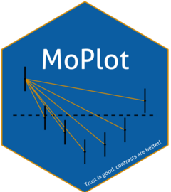

<!-- README.md is generated from README.Rmd. Please edit that file -->

```{r, include = FALSE}
knitr::opts_chunk$set(
  collapse = TRUE,
  comment = "#>",
  fig.path = "man/figures/README-",
  out.width = "100%"
)
```

# MoPlot 

<!-- badges: start -->

[](https://lifecycle.r-lib.org/articles/stages.html#experimental)
<!-- badges: end -->

MoPlot is an R package designed to visualize linear models that include categorical predictors. It enhances the interpretability of complex model outputs through clear and intuitive graphical representations, with a particular focus on the contrasts used for categorical variables. By highlighting these contrasts, MoPlot helps users better understand the specific comparisons underlying model estimates.

## Installation

You can install the development version of MoPlot like so:

``` r
devtools::install.package("MoPlot")
```

## Example

This is a basic example which shows you how to solve a common problem:

```r 
library(MoPlot)
## basic example code
```
