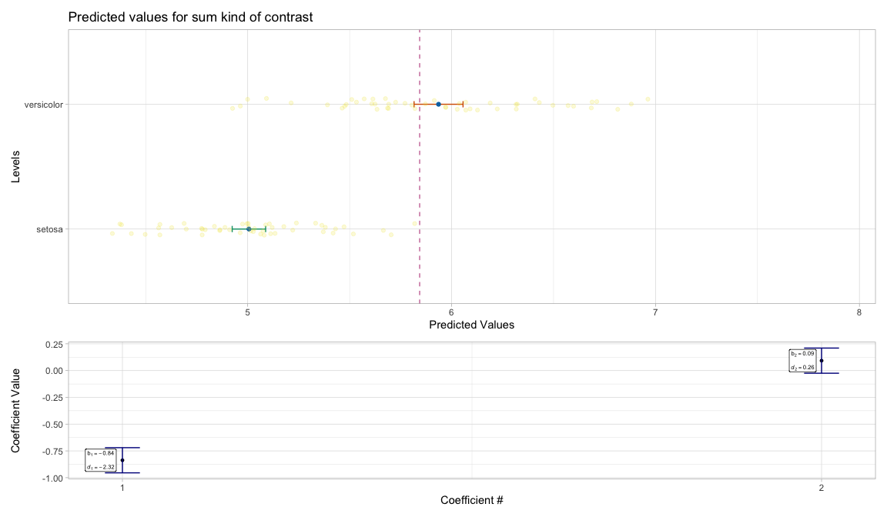
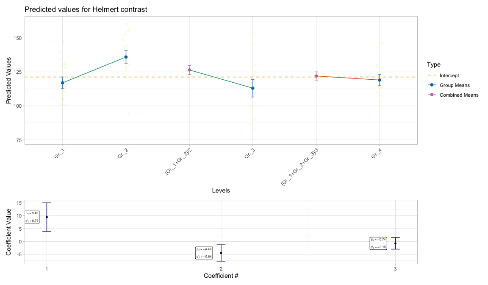

<!-- README.md is generated from README.Rmd. Please edit that file -->

# MoPlot 

<!-- badges: start -->

[](https://lifecycle.r-lib.org/articles/stages.html#experimental)
<!-- badges: end -->

MoPlot is an R package designed to visualize linear models that include
categorical predictors. It enhances the interpretability of complex
model outputs through clear and intuitive graphical representations,
with a particular focus on the contrasts used for categorical variables.
By highlighting these contrasts, MoPlot helps users better understand
the specific comparisons underlying model estimates.

## Installation

You can install the development version of MoPlot like so:

``` r
devtools::install_github("Moplot/Moplot")
```

## MoPlotOneWay

`MoPlotOneWay()` is a function for visualizing the results of a linear
model with one categorical predictor and one numeric dependent variable.
It takes as input a model created with `lm()` and produces a plot that
highlights group means with their associated uncertainty using bars, and
visually emphasizes significant contrasts through colored lines.
Optionally, the raw data points can be displayed in the plot. A
secondary panel shows the model coefficients, including standardized
beta values and effect sizes such as Cohen’s *d*, allowing for a clear
and informative summary of the model’s findings.

### Treatment coding

Treatment coding schema, without data and coefficients, sig.level at .05

``` r
library(MoPlot)

# Using Iris data
data(iris)
iris$Species <- factor(iris$Species)
contrasts(iris$Species) <- contr.treatment(3)

# Fit the model
model <- lm(Sepal.Length ~ Species, data = iris)

# MoPlotting treatment
MoPlotOneWay(model, data = FALSE, coef = FALSE, siglevel = 0.05)
#> This graphical representation illustrates the linear model, where
#>  Species is the categorical predictor (represented on the x-axis with its levels),
#>  and Sepal.Length is the numerical dependent variable (plotted on the y-axis).
#>  The contrast type applied is treatment, which compares each group mean against
#>  the baseline mean of setosa (the first level of the predictor).
#>  Blue dots indicate the expected values (means) for each group, while the error bars
#>  represent the uncertainty associated with these estimates.
#>  The dashed purple line marks the baseline expected value.
#>  Green lines highlight significant contrasts, with a significance threshold of 0.05 for the first type of error.
```


Treatment coding schema, with data and coefficients, sig.level at .05

``` r
# MoPlotting
MoPlotOneWay(model, data = TRUE, coef = TRUE, siglevel = 0.05)
#> This graphical representation illustrates the linear model, where
#>  Species is the categorical predictor (represented on the x-axis with its levels),
#>  and Sepal.Length is the numerical dependent variable (plotted on the y-axis).
#>  The contrast type applied is treatment, which compares each group mean against
#>  the baseline mean of setosa (the first level of the predictor).
#>  Blue dots indicate the expected values (means) for each group, while the error bars
#>  represent the uncertainty associated with these estimates.
#>  The dashed purple line marks the baseline expected value.
#>  Green lines highlight significant contrasts, with a significance threshold of 0.05 for the first type of error.
```


### Sum coding

Sum coding schema, without data and coefficients, sig.level at .1

``` r
# Using Sum coding
contrasts(iris$Species) <- contr.sum(3)

# Fit the model
model <- lm(Sepal.Length ~ Species, data = iris)

# MoPlotting sum
MoPlotOneWay(model, data = FALSE, coef = FALSE, siglevel = 0.1)
#> This graphical representation depicts the linear model, with
#>  Species as the categorical predictor (levels shown on the x-axis),
#>  and Sepal.Length as the numerical dependent variable (values displayed on the y-axis).
#>  The contrast type is sum, where each group mean is compared to
#>  the intercept, which serves as the baseline.
#>  Blue dots represent the expected values (means) for each group, and error bars capture
#>  the uncertainty associated with these estimates.
#>  The dashed purple line marks the intercept expected value.
#>  The green error bars highlight significant contrasts, with 0.1 as the threshold for the first type of error.
```


Sum coding schema, with data and coefficients, sig.level at .1

``` r
# MoPlotting sum
MoPlotOneWay(model, data = TRUE, coef = TRUE, siglevel = 0.1)
```



### Helmert coding

Helmert coding schema, without data and coefficients, sig.level at .05

``` r
# Using a custom function to generate data with four groups
DT <- DatasetOne(n_sample = 20, means = c(120, 135, 115, 120), sds = 20)
DT$Ind <- as.factor(DT$Ind)
contrasts(DT$Ind) <- contr.helmert(4)

# Fit the model
model <- lm(Dep ~ Ind, data = DT)

# MoPlotting sum
MoPlotOneWay(model, data = FALSE, coef = FALSE, siglevel = 0.05)
#> This graphical representation depicts the linear model, with
#>  Ind as the categorical predictor (levels are represented on the x-axis),
#>  and Dep as the numerical dependent variable (values are shown on the y-axis).
#>  The applied contrast type is helmert. In this type of contrast, each group mean is compared to
#>  the cumulative mean of all previous groups.
#>  Blue dots represent the expected values (means) for the cumulative means,
#>  while orange dots represent the expected values (means) for each individual group.
#>  Error bars indicate the uncertainty associated with each expected value.
#>  The dashed purple line marks the baseline expected value.
#>  Green lines highlight significant contrasts, with 0.05 serving as the threshold for the first type of error.
```


Helmert coding schema, with data and coefficients, sig.level at .2

``` r
# MoPlotting sum
MoPlotOneWay(model, data = TRUE, coef = TRUE, siglevel = 0.2)
```


